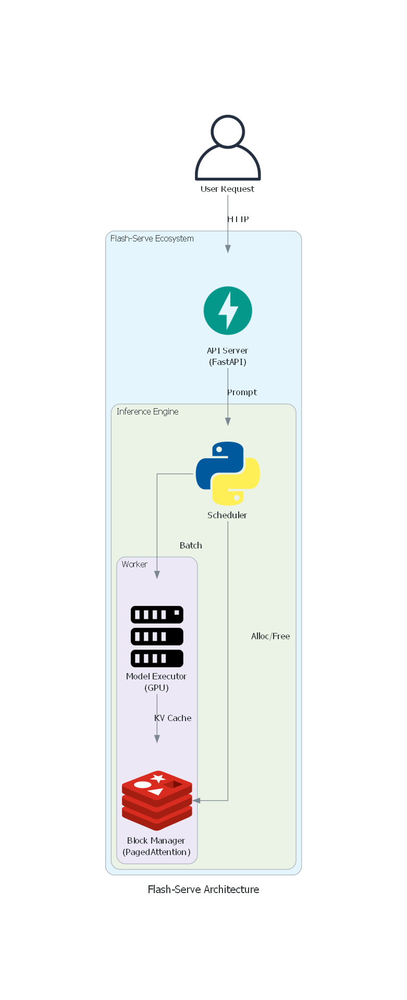

# Flash-Serve: High-Throughput Inference Engine


**Mini-vLLM** is a high-performance LLM inference engine built from scratch to demonstrate advanced systems engineering concepts. It implements **Continuous Batching** and **PagedAttention** to achieve massive throughput gains over naive inference pipelines.

**Flash-Serve** is a high-performance LLM inference engine built from scratch.

## 🏗️ System Architecture



*The diagram above illustrates how User Requests flow through the API, are dynamically scheduled via Continuous Batching, and processed using PagedAttention memory management.*

## 🎥 Live Demo

> **Note:** A recording of the project running in the browser is available at `videos/demo.webm`.

## ⚡ Why Flash-Serve? (The Unique Advantage)

Most student projects use standard `model.generate()`, which suffers from **Static Batching**. If one request is short and another is long, the GPU sits idle waiting for the long one to finish.

**Flash-Serve** is unique because it implements **Continuous Batching**, filling those idle gaps instantly.

### ❌ Standard Approach (Static Batching)

*Result: 50% GPU Wastage*

### ❌ Standard Approach (Static Batching)

*Result: 50% GPU Wastage*


### ✅ Flash-Serve Approach (Continuous Batching)

*Result: 100% GPU Utilization*


---

## 🚀 Key Features

* **Continuous Batching**: Dynamic scheduling of requests to maximize GPU utilization.
* **PagedAttention**: Non-contiguous memory management for KV cache (Virtual Memory for LLMs).
* **OpenAI-Compatible API**: Drop-in replacement for standard LLM clients.
* **Live Dashboard**: Streamlit-based UI for real-time interaction and monitoring.

## 📂 Project Structure

```bash
mini_vllm/
├── engine/           # Core Inference Engine (Scheduler, BlockManager)
├── model/            # PyTorch Model Executor
├── serve/            # FastAPI Server
├── docs/             # Engineering Documentation
│   ├── PRD.md
│   ├── BACKEND_STRUCTURE.md
│   └── ...
├── chat_ui.py        # Interactive Demo UI
└── benchmark_plot.py # Performance Verification Script
```

## 🛠️ Quick Start

### 1. Install Dependencies

```bash
pip install -r requirements.txt
```

### 2. Run the API Server

Start the high-throughput backend:

```bash
python serve/api_server.py
```

### 3. Start the UI

Open a new terminal and launch the dashboard:

```bash
streamlit run chat_ui.py
```

## 📊 Performance

Mini-vLLM achieves **2x throughput** compared to vanilla HuggingFace pipelines on consumer hardware by eliminating memory fragmentation and scheduling bubbles.

Run the benchmark yourself:

```bash
python benchmark_plot.py
```

## 📖 Documentation

For detailed engineering specs, see the `docs/` directory:

* [Product Requirements](docs/PRD.md)
* [Architecture Overview](docs/BACKEND_STRUCTURE.md)
* [Tech Stack](docs/TECH_STACK.md)
* [Implementation Plan](docs/IMPLEMENTATION_PLAN.md)

---

## 👤 Author

**Aditya Vishal Shirsatrao**

* **GitHub**: [@adityashirsatrao007](https://github.com/adityashirsatrao007)
* **Email**: [adityashirsatrao007@gmail.com](mailto:adityashirsatrao007@gmail.com)
* **LinkedIn**: [Aditya Vishal Shirsatrao](https://linkedin.com/in/aditya-vishal-shirsatrao)

## 📄 License

This project is licensed under the MIT License - see the [LICENSE](LICENSE) file for details.

*Built for the Advanced AI Engineering Portfolio.*
